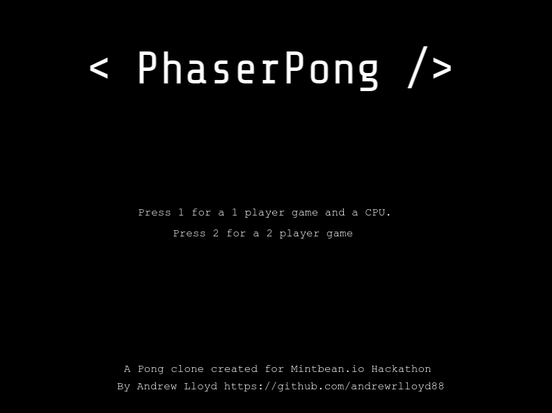
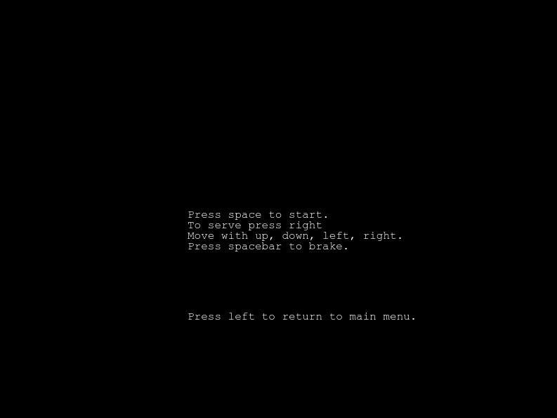
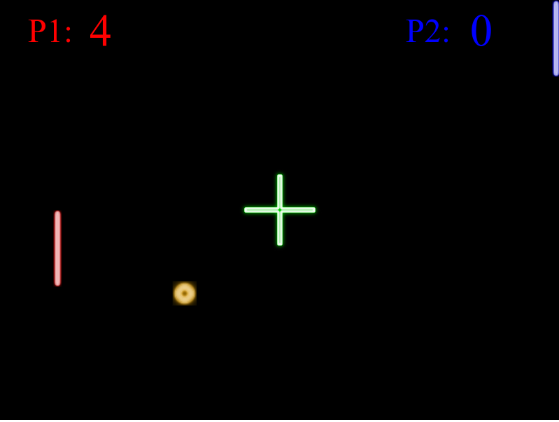
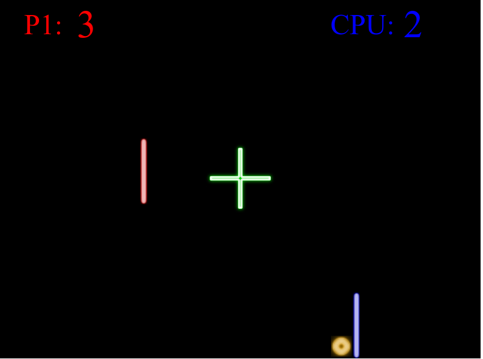
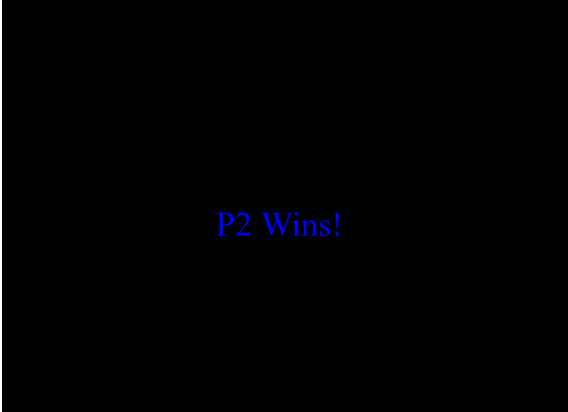
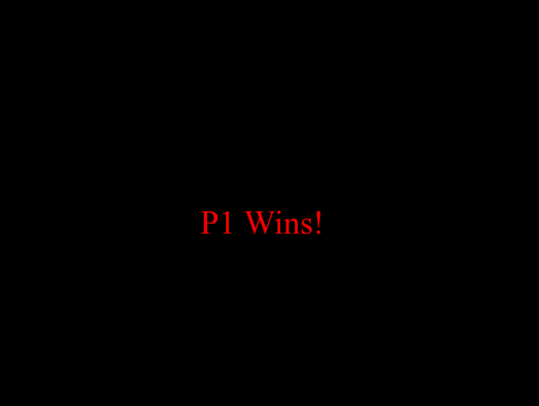

# PhaserPong

Pong game built for [Mintbean JavaScript GameHacks: Classic Pong](https://www.mintbean.io/meets). This was a one week hackathon running from November 20 - 27, 2020.

## Table of Contents

- [Live Deploy](#live-deploy)
- [The Challenge](#the-challenge)
- [Rules and Constraints](#rules-and-constraints)
- [Screenshots](#screenshots)
- [Tech Stack](#tech-stack)
- [User Stories](#user-stories)
- [Development](#development)
  - [Dependencies](#dependencies)
  - [Setup](#setup)
  - [Contributors](#contributors)

### Live Deploy

<b>Check out the app on Netlify at [https://dashboard.featurepeek.com/peek/7m4hd31m#/](https://dashboard.featurepeek.com/peek/7m4hd31m#/)</b>

### The Challenge

Citizens of Mintropolis our Mayor has kicked off the development of the Beanporium arcade.

He is asking the developers of Mintropolis create a replica of one of the very first video games in existence PONG.

Pong was a groundbreaking electronic game released in 1972 by the American game manufacturer Atari, Inc. One of the earliest video games, Pong became wildly popular and helped launch the video game industry. The original Pong consisted of two paddles that players used to volley a small ball back and forth across a screen.

### Rules & Constraints

Rules and constraints help keep everybody's projects relevant and interesting to all other participants.

The only restrictions are the following:

1. You must build a frontend web application.
2. There must be no backend server/serverless components.
3. The project is scoped for teams of 1 - 3.

### Screenshots

### Tech Stack

- JavaScript
- PhaserJS
- FeaturePeek

### User Stories

1. As a user, when the game starts I am prompted to select between 1 or 2 player
2. As a user, if I select either option I am prompted to start game or go back to main screen
3. As a user, if I select 1 player and start the game
4. As a user, the court will appear and an Indication as of which side I am on will be shown
5. As a user, if I press the up arrow on my keyboard my paddle will move up
6. As a user, if I press the down arrow on my keyboard my paddle will move down
7. As a user, I will start with the ball, to serve I shall press either the left or right arrow key to serve based on court position
8. As a user, after I serve I will see the ball travel across the court
9. As a user, if the ball collides with the wall it will change direction
10. As a user, I can see that if a ball hits a paddle that it will send the ball back
11. As a user, I can see that if a ball misses a paddle the opposing side will get a point
12. As a user, If someone scores 7 points they will will win the game
13. As a user, I can see that player 2 is controlled by a computer
14. As a user if I select 2 player (Include all game mechanics from player one as well as)
15. As a user playing as player 2 I will use WASD as my controls on the same machine
16. A a user playing as player 2 I will see what side I am on
17. As a user, When a game is one I will see the winner and be taken back to the main screen

## Development

### Dependencies

- phaser: "3.24.1"

### Setup

1. Fork this repository
2. Navigate to the directory where you want to store this project
3. git clone your forked directory
4. Navigate to the cloned directory
5. Run npm install to install all project dependencies
6. Run the app with npm start

### Contributors

Questions? Comments?

Andrew Lloyd [Github](https://github.com/AndrewRLloyd88) [Portfolio](https://arlmedia.ca/)

README: Last updated November 26, 2020
